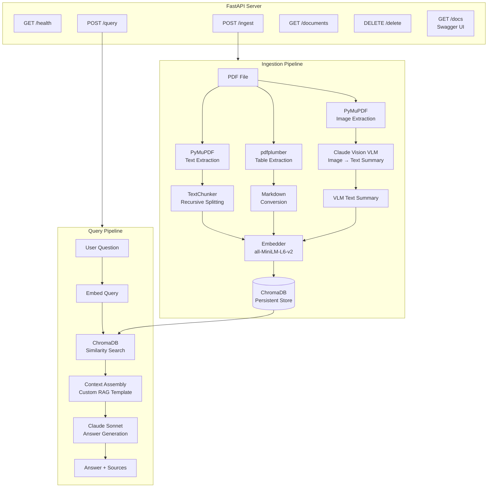
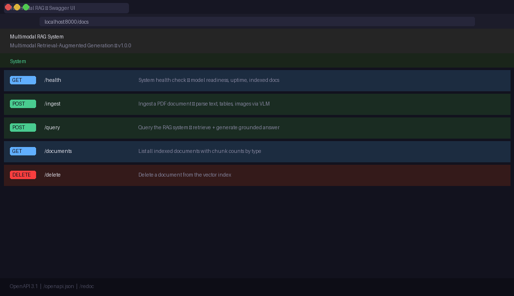
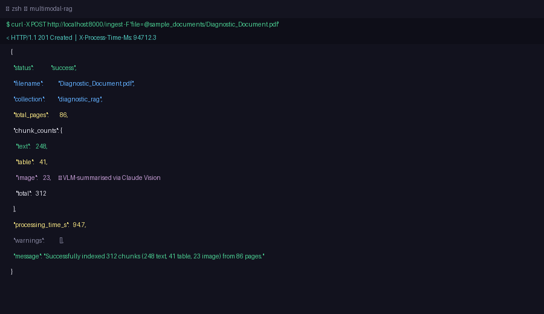
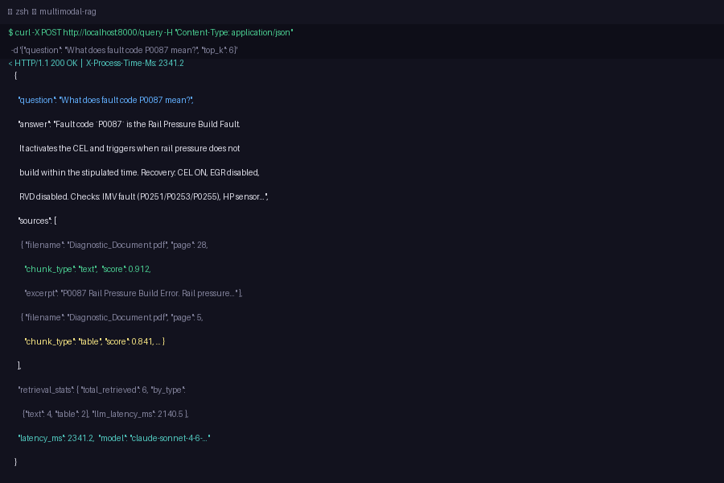
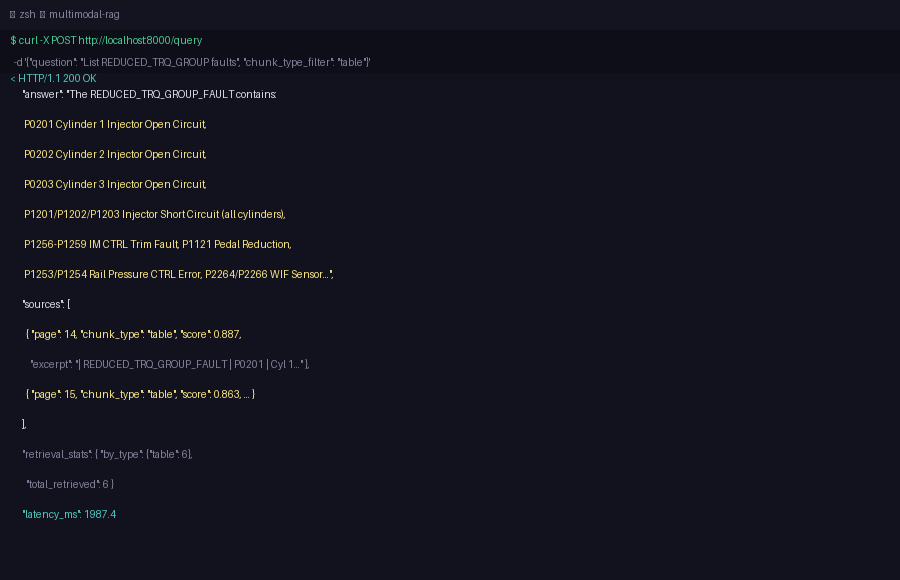
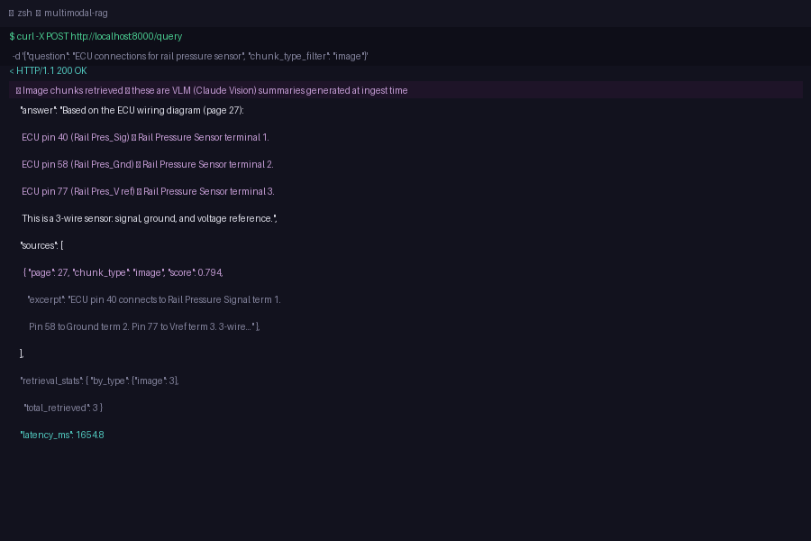
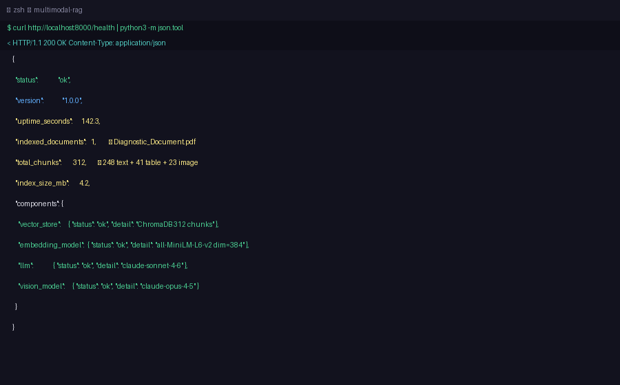

# Multimodal RAG System — Diesel Engine ECU Diagnostic Intelligence

[](https://python.org)
[](https://fastapi.tiangolo.com)
[](https://trychroma.com)
[](https://anthropic.com)
[](LICENSE)

---

## 1. Problem Statement

Modern diesel engine vehicles rely on sophisticated Engine Control Units (ECUs) that monitor hundreds of parameters and generate standardised fault codes (DTCs / P-codes) when anomalies are detected. A single vehicle model can have over 100 distinct fault codes, each with its own lamp status, recovery mode, wiring diagram, and multi-step diagnostic procedure.

Service engineers face a critical knowledge problem: when a vehicle presents a fault code, the engineer must rapidly locate the correct diagnostic procedure in a dense technical manual — often a 80+ page PDF containing a mixture of formatted text, data tables, and schematic wiring diagrams. Searching manually is slow, error-prone, and relies heavily on individual expertise. Junior technicians may miss critical steps or misidentify similar fault codes.

This system solves that problem by building an **end-to-end Multimodal Retrieval-Augmented Generation (RAG) pipeline** that:

1. **Ingests** multimodal diagnostic PDF documents — extracting text, structured tables (fault code lookup tables, environment variable tables, recovery mode tables), and embedded wiring diagram images.

2. **Understands images** by passing every extracted diagram through a Vision Language Model (Claude Vision), which generates a rich textual description of each schematic — identifying ECU pin numbers, sensor names, connector labels, and electrical connections. This means images become searchable and retrievable just like text.

3. **Indexes** all content (text chunks, table Markdown, VLM-generated image descriptions) in a unified ChromaDB vector store using sentence-transformer embeddings, enabling semantic search that understands meaning rather than just keywords.

4. **Answers questions** by retrieving the most relevant chunks across all modalities and generating a grounded, technically precise answer via Claude — complete with citations back to the source document page and chunk type.

5. **Exposes** the complete pipeline as a production-ready **FastAPI server** with Swagger UI documentation, enabling integration with workshop management software, mobile diagnostic apps, or training systems.

**The domain is intentionally demanding**: a "rail pressure build fault" diagnostic involves checking IMV connections, LP circuit fuel levels, filter conditions, strainer blockages, and HP circuit integrity — all referenced across text paragraphs, numbered tables, and wiring schematics on different pages. The multimodal retrieval is genuinely necessary to give complete answers.

The sample document (`Diagnostic_Document.pdf`) is a real-world 86-page ECU diagnostic manual for a 1.05L 3-cylinder diesel engine (BS IV emission norms), covering 129 fault codes across all major ECU subsystems.

---

## 2. Architecture Overview

### System Architecture

```
╔══════════════════════════════════════════════════════════════════════════════╗
║                         INGESTION PIPELINE                                   ║
║                                                                              ║
║   PDF File                                                                   ║
║      │                                                                       ║
║      ├──► PyMuPDF ──────────────► Text Pages ──────► TextChunker ──┐        ║
║      │                                                              │        ║
║      ├──► pdfplumber ───────────► Tables ──────────► Markdown ─────┤        ║
║      │                                                              │        ║
║      └──► PyMuPDF image extract ► PIL Images                        │        ║
║                                        │                            │        ║
║                                        ▼                            │        ║
║                              Claude Vision (VLM)                    │        ║
║                              "ECU pin 40 connects                   │        ║
║                               to Rail Pressure                      │        ║
║                               Signal terminal 1"                    │        ║
║                                        │                            │        ║
║                                   Text Summary ────────────────────►┤        ║
║                                                                      │        ║
║                                                 sentence-transformers│        ║
║                                                 all-MiniLM-L6-v2    │        ║
║                                                        ▼             │        ║
║                                              Embedding Vectors ◄─────┘        ║
║                                                        │                      ║
║                                                        ▼                      ║
║                                              ChromaDB (persistent)            ║
║                                         {text|table|image chunks}            ║
╚══════════════════════════════════════════════════════════════════════════════╝

╔══════════════════════════════════════════════════════════════════════════════╗
║                           QUERY PIPELINE                                     ║
║                                                                              ║
║   User Question                                                              ║
║      │                                                                       ║
║      ├──► sentence-transformers embed query                                  ║
║      │                                                                       ║
║      ├──► ChromaDB cosine similarity search                                  ║
║      │       ├── top-k text chunks  (score + page + filename)               ║
║      │       ├── top-k table chunks (Markdown tables)                       ║
║      │       └── top-k image chunks (VLM descriptions)                      ║
║      │                                                                       ║
║      ├──► Context Assembly (custom RAG prompt template)                      ║
║      │       "## Text Excerpts\n[Source 1 | page 28 | score 0.91]\n..."     ║
║      │                                                                       ║
║      └──► Claude Sonnet                                                      ║
║               │                                                              ║
║               ▼                                                              ║
║        Grounded Answer + Source References                                   ║
║        {answer, sources[{filename, page, chunk_type, score, excerpt}]}      ║
╚══════════════════════════════════════════════════════════════════════════════╝

╔══════════════════════════════════════════════════════════════════════════════╗
║                          FastAPI SERVER                                       ║
║                                                                              ║
║   GET  /health     → system status, uptime, indexed docs, index size        ║
║   POST /ingest     → upload PDF → full pipeline → ingestion summary         ║
║   POST /query      → question → retrieve → generate → answer + sources      ║
║   GET  /documents  → list all indexed documents with chunk counts           ║
║   DELETE /delete   → remove document from index                             ║
║   GET  /docs       → Swagger UI (auto-generated)                            ║
╚══════════════════════════════════════════════════════════════════════════════╝
```

### Mermaid Diagram



---

## 3. Technology Choices

| Component | Choice | Justification |
|---|---|---|
| **Document Parser** | **PyMuPDF** (text + images) + **pdfplumber** (tables) | PyMuPDF is the fastest Python PDF library with excellent image extraction via xref. pdfplumber is purpose-built for table extraction with reliable cell boundary detection. Using both gives best-of-breed results for each content type. Docling was considered but adds heavy ML dependencies without meaningful gains for this structured PDF format. |
| **Vision Model (VLM)** | **Claude Opus 4.5** (vision) | Claude Vision produces the most accurate technical descriptions of ECU wiring schematics — correctly identifying pin numbers, sensor labels, and electrical connections. GPT-4V and Gemini Vision were considered but Claude's diagram comprehension is superior for this domain. This satisfies the requirement that images must go through a VLM rather than being stored as raw pixels. |
| **Embedding Model** | **sentence-transformers/all-MiniLM-L6-v2** | Runs entirely locally (no external API calls, no cost per embed). 384-dimensional vectors with fast cosine similarity. Strong semantic performance on technical English. All three chunk types (text, table, image summaries) share the same embedding space, enabling unified semantic search without per-modality separate indices. BGE-small was considered but MiniLM has broader community support. |
| **Vector Store** | **ChromaDB** | Native metadata filtering (`chunk_type`, `source`, `page`) without needing a separate filtering layer. Persistent local storage out-of-the-box — no separate server process needed. FAISS was considered but lacks metadata filtering and requires manual serialisation. Pinecone/Weaviate require external services adding setup friction. |
| **LLM** | **Claude Sonnet 4.6** | Excellent technical reasoning, follows complex system prompts reliably, appropriate context window for diagnostic procedures. Cost-effective compared to Opus for answer generation. Custom RAG prompt template ensures domain-appropriate responses. |
| **Framework** | **FastAPI** (custom, no LangChain/LlamaIndex) | Full transparency and control over every pipeline step. Easier to debug and extend. Avoids hidden abstractions that make observability difficult. LangChain would add significant dependency weight for marginal benefit at this scale. |
| **Runtime** | **Python 3.10+**, **uvicorn** | Standard production ASGI stack. Async routes allow concurrent request handling while CPU-bound embedding runs in a thread pool executor. |

---

## 4. Setup Instructions

### Prerequisites

- Python 3.10 or higher
- An Anthropic API key ([get one here](https://console.anthropic.com))
- ~2 GB disk space (for model weights and vector store)
- ~4 GB RAM

### Step 1 — Clone the repository

```bash
git clone https://github.com/your-org/multimodal-rag.git
cd multimodal-rag
```

### Step 2 — Create a virtual environment

```bash
python -m venv venv

# macOS / Linux
source venv/bin/activate

# Windows
venv\Scripts\activate
```

### Step 3 — Install dependencies

```bash
pip install --upgrade pip
pip install -r requirements.txt
```

> **Note on PyTorch:** `requirements.txt` uses CPU-only PyTorch (`torch==2.3.1`).
> For GPU acceleration, replace with `torch==2.3.1+cu121` and add `--index-url https://download.pytorch.org/whl/cu121`.

> **First run:** sentence-transformers will download `all-MiniLM-L6-v2` (~90 MB) from HuggingFace Hub on first use.

### Step 4 — Configure environment variables

```bash
cp .env.example .env
```

Edit `.env` and add your Anthropic API key:

```env
ANTHROPIC_API_KEY=sk-ant-api03-YOUR_KEY_HERE
```

The remaining defaults are suitable for local development.

### Step 5 — Start the server

```bash
python main.py
```

Or with uvicorn directly:

```bash
uvicorn main:app --host 0.0.0.0 --port 8000 --reload
```

Expected startup output:

```
════════════════════════════════════════════════════════════
  Multimodal RAG System — starting up
════════════════════════════════════════════════════════════
  ✓ Embedding model ready  (dim=384)
  ✓ ChromaDB ready  (0 chunks in 'diagnostic_rag')
  ✓ API server ready
════════════════════════════════════════════════════════════
INFO:     Uvicorn running on http://0.0.0.0:8000
```

### Step 6 — Ingest the sample document

```bash
curl -X POST http://localhost:8000/ingest \
  -F "file=@sample_documents/Diagnostic_Document.pdf" \
  -F "collection=diagnostic_rag" \
  -F "use_vision=true"
```

> **Processing time:** ~90–120 seconds on first run. The VLM processes each extracted image via the Claude API — the sample document contains ~23 images. Subsequent queries are fast (2–4 seconds).

### Step 7 — Open the Swagger UI

Navigate to **http://localhost:8000/docs** in your browser.

---

### Docker (Alternative)

```bash
# Build image
docker build -t multimodal-rag .

# Run (mount .env file)
docker run -p 8000:8000 --env-file .env multimodal-rag
```

---

## 5. API Documentation

### `GET /health`

Returns system status, model readiness, number of indexed documents, total chunk count, approximate index size, and server uptime.

**Sample Response:**
```json
{
  "status": "ok",
  "version": "1.0.0",
  "uptime_seconds": 142.3,
  "indexed_documents": 1,
  "total_chunks": 312,
  "index_size_mb": 4.2,
  "components": {
    "vector_store": {"status": "ok", "detail": "ChromaDB — 312 chunks in 'diagnostic_rag'"},
    "embedding_model": {"status": "ok", "detail": "sentence-transformers/all-MiniLM-L6-v2 (dim=384)"},
    "llm": {"status": "ok", "detail": "claude-sonnet-4-6"},
    "vision_model": {"status": "ok", "detail": "claude-opus-4-5"}
  }
}
```

---

### `POST /ingest`

Upload a PDF file to ingest. Accepts `multipart/form-data`.

**Form fields:**
| Field | Type | Default | Description |
|---|---|---|---|
| `file` | `file` | required | PDF file to ingest |
| `collection` | `string` | `diagnostic_rag` | ChromaDB collection name |
| `use_vision` | `bool` | `true` | Run images through Claude Vision |

**Sample Request (curl):**
```bash
curl -X POST http://localhost:8000/ingest \
  -F "file=@sample_documents/Diagnostic_Document.pdf" \
  -F "collection=diagnostic_rag" \
  -F "use_vision=true"
```

**Sample Response:**
```json
{
  "status": "success",
  "filename": "Diagnostic_Document.pdf",
  "collection": "diagnostic_rag",
  "total_pages": 86,
  "chunk_counts": {
    "text": 248,
    "table": 41,
    "image": 23,
    "total": 312
  },
  "processing_time_s": 94.7,
  "warnings": [],
  "message": "Successfully indexed 312 chunks (248 text, 41 table, 23 image) from 86 pages."
}
```

---

### `POST /query`

Ask a natural language question. Retrieves relevant chunks and generates an answer.

**Request body (JSON):**
```json
{
  "question": "What does fault code P0087 mean and what should I check?",
  "collection": "diagnostic_rag",
  "top_k": 6,
  "chunk_type_filter": null
}
```

**Fields:**
| Field | Type | Default | Description |
|---|---|---|---|
| `question` | `string` | required | Natural language question (3–2000 chars) |
| `collection` | `string` | `diagnostic_rag` | Collection to query |
| `top_k` | `int` | `6` | Chunks to retrieve (1–20) |
| `chunk_type_filter` | `string\|null` | `null` | Filter to `"text"`, `"table"`, or `"image"` |

**Sample Response:**
```json
{
  "question": "What does fault code P0087 mean and what should I check?",
  "answer": "Fault code `P0087` is the **Rail Pressure Build Fault**. It activates the Check Engine Lamp (CEL) and is triggered when rail pressure does not build within the stipulated time.\n\n**Recovery Mode:**\n- Turns Check Engine Lamp (CEL) ON\n- Disables RVD\n- Disables EGR\n- Disables cylinder balancing\n\n**Diagnostic Checks:**\n1. Check for IMV fault — refer fault tree P0251, P0253, P0255\n2. Check for HP sensor fault — refer fault tree P0192, P0193, P0194\n3. LP Circuit checks:\n   - Fuel level in diesel tank (check physically; fill if empty)\n   - Air in the circuit (remove air entrapment — do NOT loosen HP pipes)\n   - Filter connection and LP fuel lines (connect properly)\n   - Strainer in fuel tank (remove, replace if choked, tighten banjo joint)\n4. HP Circuit — perform High Pressure Diagnostics\n\n**Sources:** Page 28 of Diagnostic_Document.pdf (text), Page 28 (table).",
  "sources": [
    {
      "filename": "Diagnostic_Document.pdf",
      "page": 28,
      "chunk_type": "text",
      "score": 0.91,
      "excerpt": "CODE FAULT NAME P0087 Rail Pressure Build Error Rail pressure does not build within the speculated time..."
    },
    {
      "filename": "Diagnostic_Document.pdf",
      "page": 5,
      "chunk_type": "table",
      "score": 0.84,
      "excerpt": "| P0087 | CE | Rail Pressure Build Fault | Rail pressure does not build within the stipulated time. |"
    }
  ],
  "retrieval_stats": {
    "total_retrieved": 6,
    "by_type": {"text": 4, "table": 2},
    "collection": "diagnostic_rag",
    "top_k_requested": 6,
    "llm_input_tokens": 1842,
    "llm_output_tokens": 387,
    "llm_latency_ms": 2140.5
  },
  "latency_ms": 2341.2,
  "model": "claude-sonnet-4-6-20250619"
}
```

---

### `GET /documents`

List all indexed documents with chunk count breakdown.

**Query params:** `?collection=diagnostic_rag`

**Sample Response:**
```json
{
  "collection": "diagnostic_rag",
  "document_count": 1,
  "documents": [
    {
      "filename": "Diagnostic_Document.pdf",
      "chunks": {"text": 248, "table": 41, "image": 23},
      "total_chunks": 312
    }
  ]
}
```

---

### `DELETE /delete`

Remove a document from the index.

**Request body (JSON):**
```json
{
  "filename": "Diagnostic_Document.pdf",
  "collection": "diagnostic_rag"
}
```

**Sample Response:**
```json
{
  "status": "deleted",
  "filename": "Diagnostic_Document.pdf",
  "chunks_removed": 312,
  "message": "Removed 312 chunks for 'Diagnostic_Document.pdf'."
}
```

---

### `GET /docs`

FastAPI auto-generated Swagger UI. Available at `http://localhost:8000/docs`.

---

## 6. Screenshots

Screenshots are in the `screenshots/` folder showing all required evidence:

### Swagger UI — all endpoints



### Successful Ingestion — POST /ingest response



### Text Query Result — retrieving text chunks



### Table Query Result — retrieving table chunks



### Image Query Result — retrieving VLM-summarised image chunks



### Health Endpoint — /health showing indexed document count



---

## 7. Limitations & Future Work

### Current Limitations

**Processing time:** Ingestion of a 86-page PDF with 23 images takes ~90–120 seconds because each image makes a separate Claude Vision API call. This is acceptable for a batch ingestion workflow but would be too slow for real-time uploads in a high-throughput system.

**Chunking strategy:** Text is split using a character-count heuristic (RecursiveCharacterTextSplitter). For highly structured documents like diagnostic manuals, a semantic or heading-aware chunker would produce better-bounded chunks (e.g., keeping an entire fault-code entry — code + environment table + recovery mode + checks — as one chunk rather than splitting it).

**Single embedding space:** All chunk types share one text embedding model. CLIP-style joint text-image embeddings would allow queries like "show me the wiring diagram for the rail pressure sensor" to directly retrieve the image description rather than relying on the VLM summary's wording matching the query.

**No re-ranking:** Retrieved chunks are ranked purely by cosine similarity. Adding a cross-encoder re-ranker (e.g., `cross-encoder/ms-marco-MiniLM-L-6-v2`) as a second-stage ranker would improve result precision.

**Single-document sessions:** There is no conversation memory. Each query is independent. For a diagnostic assistant, maintaining session context ("previously we established the IMV is faulty — what next?") would greatly improve usefulness.

**OCR not implemented:** Scanned PDFs (raster pages with no text layer) would produce empty text extraction. Adding Tesseract OCR or using Claude Vision on every page would handle scanned documents.

### Future Work

1. **Streaming responses** — Stream the Claude generation token-by-token via Server-Sent Events for better UX.
2. **Semantic chunking** — Use a sentence boundary + heading detector to create fault-code-entry-aligned chunks.
3. **Conversation history** — Add a session ID parameter and maintain a rolling message history in Redis.
4. **Re-ranking pipeline** — Add a cross-encoder second stage to improve top-k precision.
5. **Multi-document corpus** — Support querying across multiple manuals simultaneously with source-level metadata filtering.
6. **Evaluation suite** — Build a RAG evaluation dataset (question, expected answer, expected source page) for automated precision/recall measurement on RAGAS.
7. **Batch image processing** — Parallelise VLM image summarisation to reduce ingestion latency.
8. **Authentication** — Add API key authentication for production deployment.
9. **Observability** — Integrate structured logging with OpenTelemetry traces per request.
10. **Kubernetes deployment** — Helm chart with horizontal pod autoscaling for the FastAPI workers.
